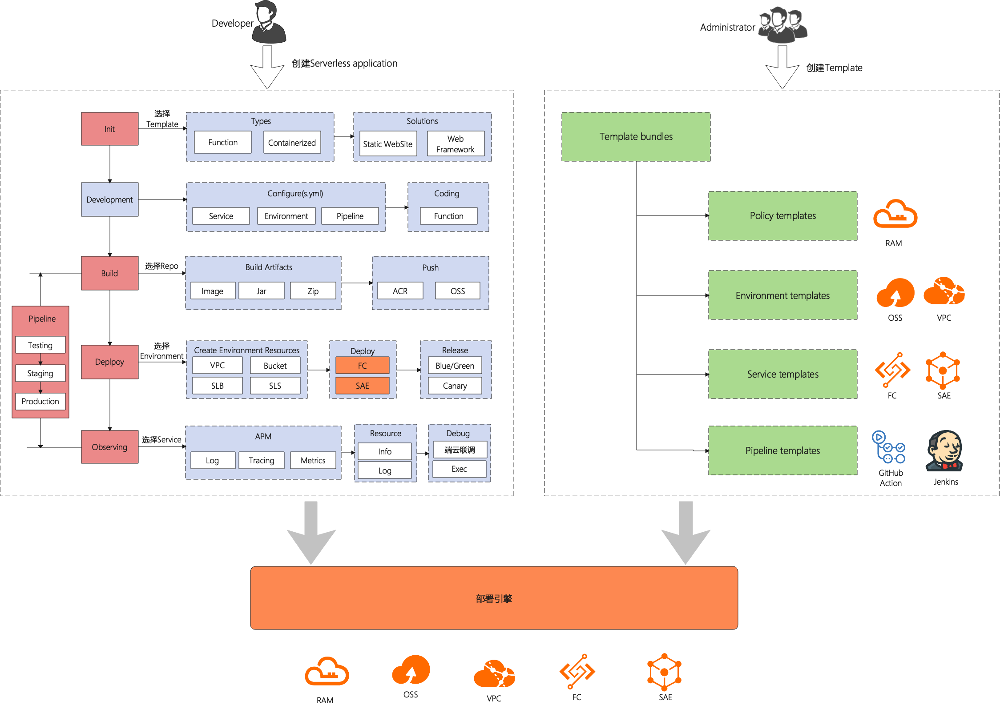
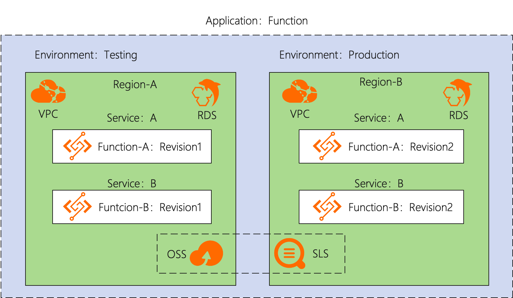

# 多环境操作：Env

- [快速使用](#快速使用)
  - [创建环境](#创建环境)
    - [引导式操作创建](#引导式操作创建)
  - [部署环境](#部署环境)
  - [删除环境](#删除环境)
  - [指定环境部署服务](#指定环境部署服务)
    - [使用差异化配置](#使用差异化配置)
  - [多环境Pipeline](#多环境Pipeline)
    - [引导式交互操作](#引导式交互操作)
- [背景及原理](#背景及原理)
  - [Serverless Devs多环境](#Serverless Devs多环境)
  - [Infrastructure as Template](#Infrastructure as Template)
  - [整体工作流](#整体工作流)
  - [概念组成](#概念组成)
    - [Application](#Application)
    - [Service](#Service)
    - [Pipeline](#Pipeline)
- [最佳实践](#最佳实践)
  - [场景一、使用FC部署NodeJs函数](#场景一、使用FC部署NodeJs函数)
    - [平台管理员定义基础设施模板](#平台管理员定义基础设施模板)
    - [研发用户使用`S`进行操作](#研发用户使用S进行操作)
      - [安装最新S工具](#安装最新S工具)
      - [编辑s.yaml，创建服务](#编辑s.yaml，创建服务)
      - [构建代码](#构建代码)
      - [创建测试环境](#创建测试环境)
      - [部署服务到测试环境](#部署服务到测试环境)
      - [创建生产环境](#创建生产环境)
      - [部署服务到生产环境，并使用差异化配置](#部署服务到生产环境，并使用差异化配置)
      - [使用Github进行CI/CD](#使用Github进行CI/CD)

--------
# 快速使用
## 创建环境
```
s env init --filename fc-env-testing.yaml
```
执行成功后，会在本地.s目录下创建`env/fc-env-testing.yaml`描述文件，您可以查看并编辑该文件
```yaml
#.s/env/fc-env-testing.yaml
name: fc-env-testing #环境名
region: cn-hangzhou #地域
roleArn: acs:ram::${accountId}:role/aliyunfcdefaultrole #关联角色arn
template: "serverless-devs.com/alicloud-fc/environment"  #引用环境模板
props: #以下参数由环境模板定义
  namePrefix: fc-testing #资源名字前缀
  createLog: true #是否创建sls project、logstore，默认false
  createBucket: true #是否创建oss bucket，默认false
  createNas: true #是否创建nas文件系统、挂载点，默认false
```
### 引导式操作创建
```
s env init
```
执行成功后，会进入引导式操作，提示您输入环境名以及其他属性

## 部署环境
```
s env deploy --name fc-env-testing
```
执行指令后，Serverless Devs会进行环境基础设施的部署，此时环境的所有信息都是持久化的，您不用担心本地配置文件删除后无法恢复的问题

## 指定环境部署服务
```
s deploy --env fc-env-testing
```
* 执行指令后，Serverless Devs会先判断环境是否已经部署，如果环境状态是ready的则会将`s.yaml`中的服务部署到该环境上；
否则会先部署环境，再部署`s.yaml`中的服务
* 当指定环境部署时，您可以使用环境的信息覆盖服务的配置：
  * 如果要使用环境提供的SLS资源，可以在`s.yaml`中如下指定logConfig：
    ```yaml
    logConfig:
      project: ${environment.outputs.slsProject}
      logstore: ${environment.outputs.slsLogStore}
    ```
  * 如果要使用环境提供的NAS资源，可以在`s.yaml`中如下指定vpcConfig和nasConfig：
    ```yaml
    vpcConfig:
      vpcId: ${environment.outputs.vpcId}
      securityGroupId: ${environment.outputs.securityGroupId}
      vswitchIds:
      - ${environment.outputs.vswitchId}
    nasConfig:
      userId: 10003
      groupId: 10003
      mountPoints:
      - serverAddr: ${environment.outputs.nasMountTargetId}
        nasDir: /fc-deploy-service
        fcDir: /mnt/auto
    ```
  * 在实际场景中，FC的服务概念往往和一个环境相关联，通常在创建服务时服务名要带上环境的后缀，比如**service-prod**。当指定环境部署时，您完全可以在`s.yaml`中如下设置，让您的服务和环境自动关联：
    ```yaml
      service:
        name: ${environment.name}
    ```
    ```yaml
      service:
        name: my-fc-${environment.name}
    ```
  * 当指定了环境时，您无需在props中指定region，组件会自动保证将服务部署到环境所在的region。当`s.yaml`中的region和环境所在region不匹配时，会自动替换成环境所在region

### 使用差异化配置
当您将服务部署到指定的环境上时，如果希望在该环境下使用差异化的配置(比如测试环境的函数内存为1024，生产环境的内存为2048)，可以通过`--overlays`参数
```
 s deploy --env fc-env-testing --overlays '{"function":{"memorySize":256,"timeout":120}}'
```
通过```---overlays```参数，会使用指定的配置增量替换(Patch操作) props中的值

## 多环境Pipeline
当需要通过多环境组织您的CI/CD流水线时，可以通过如下指令操作
```shell
s pipeline init --name fc-pipeline --provider github --stages \
  '{"stages":[{"name":"testing","environment":"fc-env-testing"},{"name":"staging","service":"demo-service","environment":"fc-env-staging","overlays":{"function":{"memorySize":1024,"timeout":120}}},{"name":"production","environment":"fc-env-staging"}]}'
```
执行成功后，会在`.s/pipeline`目录中生成`fc-pipeline.yaml`文件，您可以查看并编辑该文件

```yaml
#.s/pipeline/fc-pipeline.yaml
name: fc-pipeline
# 触发pipeline事件源
source:
  #  github action schema
  on:
    push:
      branches:
        - master
    pull_request:
      branches:
        - master

# 部署配置
stages:
  - name: testing
    environment: fc-env-testing #指定环境

  - name: staging
    service: demo-service #指定服务
    environment: fc-env-staging #指定环境
    overlays: #增量替换配置
      function:
        memorySize: 1024
        timeout: 120
  - name: production
    environment: fc-env-production #指定环境
```
指令执行成功后，如果您使用的是github作为VCS，会在`.github/workflows`目录下生成`fc-pipeline.yaml`，即帮助您自动创建Github Action配置
```yaml
name: fc-pipeline
on:
  pull_request:
    branches:
    - master
  push:
    branches:
    - master
jobs:
  initializer:
    name: initializer job
    runs-on: ubuntu-latest
    steps:
    - name: checkout source code
      uses: actions/checkout@v2
    - name: Initializing Serverless-Devs
      uses: Serverless-Devs/serverless-devs-initialization-action@main
      with:
        AccessKeyID: ${{ secrets.ALIYUN_ACCESS_KEY_ID }}
        AccessKeySecret: ${{ secrets.ALIYUN_ACCESS_KEY_SECRET }}
        AccountID: ${{ secrets.ALIYUN_ACCOUNT_ID }}
        provider: alibaba
  build-demo-service:
    name: build alicloud function of service demo-service
    needs: initializer
    runs-on: ubuntu-latest
    steps:
    - name: Install npm
      uses: actions/setup-node@v2
      with:
        node-version: ${{ matrix.node-version }}
    - name: Build package and make artifacts used serverless devs
      run: s build
    strategy:
      matrix:
        node-version:
        - 10.x
        - 12.x
        - 14.x
        - 15.x
  deployment:
    name: Deploy the service with multi environments
    needs:
    - build-demo-service
    runs-on: ubuntu-latest
    steps:
    - name: testing
      run: s deploy --env fc-env-testing
    - name: staging
      run: >-
        s demo-service deploy --env fc-env-staging
        --overlays '{"memorySize":1024,"timeout":120}'
  - name: production
      run: >-
        s deploy --env fc-env-production
```
### 引导式交互操作

# 背景及原理
随着以现代化应用的普及，项目中会涉及越来越多的云资源。对于一家现代化企业，平台团队根据业务场景进行抽象，对研发人员屏蔽了基础设施；基础设施团队根据职责边界，又为平台团队规划了不同的子账号以及权限策略。
这种分层管理必然的结果是应用和基础设施的生命周期完全不同，基础设施管理员、平台管理员、研发人员关注的云资源视角也不尽相同。比如：
* 基础设施管理员管理整家企业的云账号，为各个平台团队设置不同子账号以及访问策略；
* 平台管理员持有子账号，根据容灾及高可用场景划分网络、安全、流量策略，并且根据业务场景规划日志、存储、数据库的规格、备份配置、Quota等，或者购买K8s集群；
* 研发人员在使用平台过程中，仅需关注代码、数据、配置等程序相关内容：
  * 当需要访问数据库时，向平台索要数据连接串；
  * 当需进行日志采集时，仅需采集路径提交给平台，由平台操作日志服务完成日志采集配置挂载；
  * 当需要使用持久化存储时，仅需将本地挂载路径提交给平台，由平台操作存储服务完成文件目录挂载；
  * 当需要访问K8s集群时，向平台索要K8s访问凭证；

因此，随着职责边界的不同，必然存在的天然的关注点分离，比较有效的做法是将各个环境进行模板化，比如：
* 基础设施管理员将账号以及访问策略封装成Policy模板；
* 平台管理员选择Policy模板，填写Policy/Role name，即可自助创建服务账号，并且关联访问策略；
* 平台管理员将网络、安全、流量策略、K8s集群根据测试/生产隔离的需求封装成Environment模板；将日志服务、存储、数据库这些需要伴随应用实时开通的资源封装成Service模板；
* 研发人员选择Environment模板进行环境部署；选择Service模板，以及关联的环境，将日志、存储、数据库，已经应用程序部署到指定的环境上；

通过这种分边界的模板化的处理方式，可以让企业不同的团队自助完成基础设施的搭建，提高生产效率的同时，又保证了权限隔离，让基础设施受到保护。

### Serverless Devs多环境
Serverless Devs是一款面向Serverless应用生命周期的DevsOps工具，目前缺少对多环境的内在支持。目前的做法是为不同的环境维护不同的s.yaml，或者
通过环境变量的方式用以区分多环境，这种方式的弊端主要有3点：
1. 配置维护成本比较高，当需要更新环境时需要重新发起部署，对接CI/CD系统时，就要重新发起一次完整的发布上线操作。但通常情况下环境的变化(例如升降配、更新权限)
   对程序来说是安全的，不需要发起一次上线；
2. 难以实现基础设施团队、平台团队、研发团队分层协作的场景。比如研发人员需要将程序使用的VPC、VSwitch、文件系统ID等无关信息进行明文存储，并且需要对子账号ak/sk进行明文存储，无疑减低了研发效率并增加了安全风险；
3. 对于一些资源的变更可能会引起实例重建或者不能提供服务(比如更改数据库引擎、ACK绑定的SLB)，这些风险组件开发者未必会清楚也可能会忽略，即使清楚也需要Case By Case的通过很多判断代码来解决，也增加了组件开发的复杂度和使用成本；

如果采用上面分层的模板化方案，以上问题就可以顺利解决：
1. 平台团队通过封装Environment模板，仅需对研发人员暴露安全的参数(比如实例规格)，研发人员可以直接更新环境，而不需要重新发起一次上线操作；
2. 平台团队通过封装Policy模板，研发人员在部署环境或者服务涉及到资源的操作时，通过角色扮演的方式安全访问云资源，不需要感知ak/sk；

## Infrastructure as Template
* Serverless Devs离不开对云资源的操作，现在的做法是直接使用云产品SDK，或者封装成Pulumi的Stack，但都需要通过GPL来完成，这需要开发者对TypeScript有一定开发经验，
对于非Nodejs的玩家来说，还是有一定的学习成本的，也不利于组件的功能扩展。 
* 目前基础设施管理最强大的工具是Terraform，基本已成为事实标准。Terraform的HCL本身是一种DSL，任何生态都能很好地兼容，特别是Provider极其丰富。
阿里云的云产品如果对接POP，已经可以自动生成Terraform的Provider，其可靠性和接入便捷程度已经相当之高。<br>
如果将Serverless Devs关于基础设施操作的能力抽离出来，通过Terraform来完成，这样可以极大拓宽用户领域，用户可以通过编写Terraform文件来定义自己的基础设施。

结合上述，通过分层化的模板来管理基础设施，并且和Serverless Devs相结合，可以为Serverless Devs用户带来以下价值:
* 让Serverless Devs满足企业级IT基础设施的复杂场景：基础设施团队/平台团队/业务团队自助化操作、安全隔离、多环境CI/CD
* 让Serverless Devs可以集成各种开源生态，实现应用架构以及基础设施的可定制、可扩展、可重用能力：
  - 可自定义IaC(Terraform/Pulumi/Crossplane)、应用交付方式(镜像/代码)、CI/CD Pipeline(GithubAction/Jenkins)
  - 环境和服务相解耦，通过模板组合及引用完成能力扩展及复用

## 整体工作流



## 概念组成


### Application
一组`Service`、`Policy`、`Environment`、`Pipeline`所有资源的集合

### Service
`Application`可以关联一组`Service`，每个`Service`都是对代码、程序的描述，只描述跟程序相关的信息，比如函数配置、日志采集配置(只用关注采集路径)
* 对于函数型应用，`Service`一般描述一个函数
* 对于容器化应用，`Service`一般描述一个Workload

### Environment
`Service`运行在多个`Environment`上，每个`Environment`都是`Service`运行的载体，描述了基础设施(如网络、集群、存储)的配置，以及应用运行时的运维配置(如弹性伸缩、资源规格)
* `Environment`是部署的范畴，不关注跟代码相关配置
* `Environment`可以被多个Service共享

### Pipeline
每个`Service`关联一个`Pipeline`，描述了CI/CD的配置，包括**source**、**initial**、**build**、**deploy**阶段
* **source**：触发`Pipeline`执行的事件源，比如git仓库的master分支每次合入操作触发一次`Pipeline`的执行
* **initial**：构建前执行的动作，通常是安装依赖
* **build**：自定义构建配置，`S`提供了默认的build能力，如果指定了就不执行s build
* **deploy**：描述部署配置，包含多个stage，每个stage关联一个`Environment`

# 最佳实践
## 场景一、使用FC部署NodeJs函数

### 平台管理员定义基础设施模板
**环境模板**：原生Terraform文件

* 每个环境提供完全新建的基础设施，自动创建 VPC、VSwitch、Security、OSS、SLS、NAS
* [代码](https://code.aone.alibaba-inc.com/serverless/serverless-devs-templates/blob/master/serverless-devs.com/alicloud/fc/environment/template/environment.tf)

### 研发用户使用S进行操作
#### 安装最新S工具
```
npm i @serverless-devs/s -g
```

#### 编辑s.yaml，创建服务
```yaml
edition: 1.0.0        #  命令行YAML规范版本，遵循语义化版本（Semantic Versioning）规范
name: alicloud-fc-demo   #  项目名称

services:
  srv-test: #  服务名称
    component: devsapp/infrastructure-as-template 
    props:
      service:
        name: ${environment.name} #使用环境名作为服务名
        description: demo service
        internetAccess: true
      function:
        name: function-demo
        runtime: nodejs12
        codeUri: './code'
        handler: index.handler
        memorySize: 128
        timeout: 60
    actions: # 自定义执行逻辑
      pre-deploy: # 在deploy之前运行
        - run: s build  # 要运行的命令行
          path: . # 命令行运行的路径
```

#### 创建测试环境
```
s env init --name env-testing
```

#### 部署服务到测试环境
```
s deploy --env env-testing
```

#### 创建生产环境
```
s env init --name env-production
```

#### 部署服务到生产环境，并使用差异化配置
```
 s deploy --env env-testing --overlays '{"function":{"memorySize":256,"timeout":120}}'
```

#### 使用Github进行CI/CD
```shell
s pipeline init 
```
push代码，在Github上查看CI/CD过程

